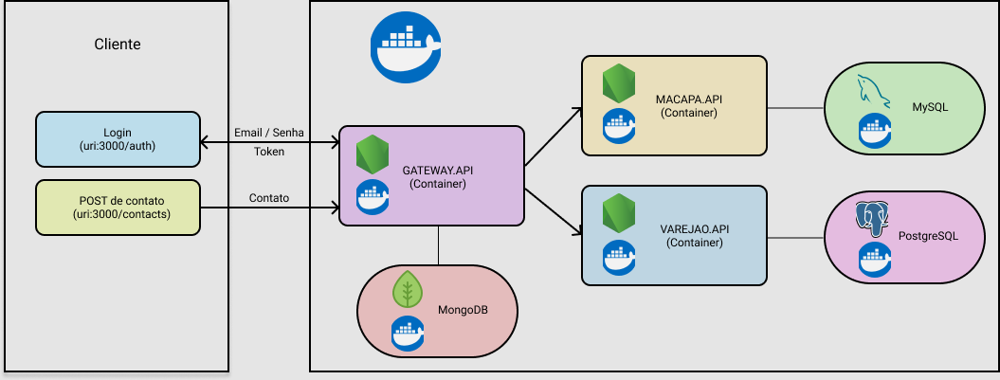

<h2 align="center">
    Mercafacil API
</h2>
<h2 align="center">
    
</h2>

### :running: Como rodar

Com docker-compose:

- Execute no terminal:
```
docker-compose build
```
- Em seguida:
```
docker-compose up -d
```

### :busts_in_silhouette: Salvando um novo contato

### Cliente Macapá:

- Login: POST para http://localhost:3000/auth com o json abaixo:
```
{
	"username": "macapa",
	"password": "123456"
}
```
- Salvar contato: POST para http://localhost:3000/contacts com o json abaixo:
```
{
	"nome": "Marina Rodrigues",
	"celular": "5541996941919"
}
```


